# Eduka-Customizer 0.15 Alpha

**Eduka-Customizer** builds live ISO images of **your own Debian-based
distribution**. It takes a Debian live image (or a Debian derivative such as
LMDE, a fresh Debian base, or the running computer) and guides you **step by
step** to a new, bootable ISO: repositories, identity, users, language,
desktop, software, kernel and boot menu, look and feel, installer, and a
**check before the build**. Every name is yours: nothing is preset for a
particular distribution (earlier versions were made only for Edukasaun OS;
**Eduka-Desktop** stays available as one of the desktops).

The images it builds are always **Debian-based**: Debian stable, testing, sid
or a **Debian derivative such as LMDE** (Ubuntu-based images are refused as a
source). The recommended start is the **Debian live standard ISO**: no
desktop, small and clean. Eduka-Customizer itself can be installed on Debian,
Debian derivatives, **Ubuntu and Ubuntu-based** computers.

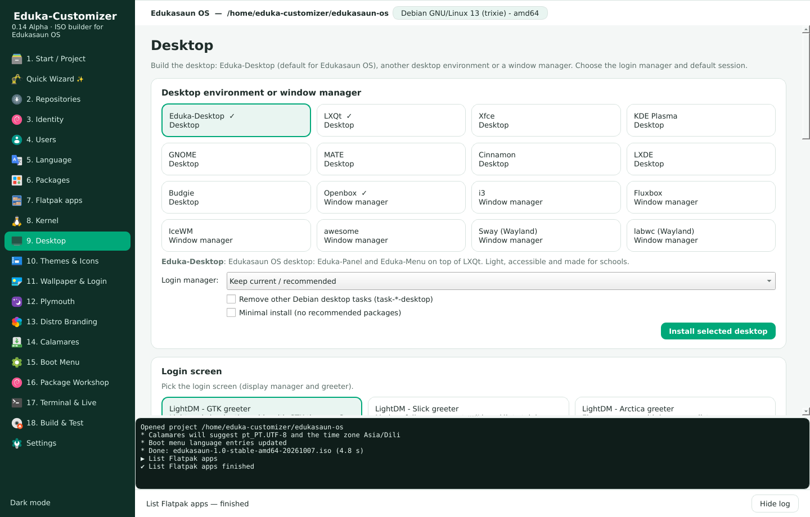

> Eduka-Customizer is a complete rewrite of *Customizer* (Ivailo Monev,
> Mubiin Kimura, Graham Cantin and contributors). It takes ideas from
> *Cubic*, *remastersys* and *penguins-eggs*.

## New in 0.15

* **For every Debian-based distribution.** New projects start empty (name, ID, host name, home page);
  until you name your distribution the image's own `os-release` is used. Old projects keep working:
  their `*-edukasaun*` configuration files are renamed automatically.
* **Step by step.** 12 numbered steps; a step opens when the one before it is done
  (*Done — next step*). Settings → *Free navigation* opens every menu at any time (expert mode); the
  Quick Wizard opens all steps when it finishes.
* **Merged menus.** Related pages share one menu as tabs: *Identity & Branding*, *Software* (Packages,
  Flatpak, Replace apps), *Kernel & Boot*, *Look & Feel* (Themes & Icons, Wallpaper & Login,
  Plymouth), *Advanced* (Terminal & Live, Package Workshop).
* **Desktop editions.** Every desktop and window manager in **Mini**, **Compact**, **Full** or
  **Full with apps**. The list contains only what Debian ships: GNOME, KDE Plasma, Xfce, Cinnamon,
  MATE, LXQt, LXDE, Budgie, GNOME Flashback, Enlightenment, Eduka-Desktop and the window managers
  Openbox, i3, Fluxbox, IceWM, awesome, JWM, herbstluftwm, bspwm, dwm, spectrwm, Sway, labwc, Wayfire
  and Hyprland (trixie and newer). Native compositors: Mutter, KWin, xfwm4, Muffin, Marco, Metacity,
  Budgie's and Enlightenment's.
* **ISO editions.** *What is your distribution for?* now asks for **Minimal**, **Full** or **Full with
  recommended apps**.
* **Replace default applications.** Swap the browser, mail, word processor, spreadsheet, editor, file
  manager, terminal, image viewer, video and music player, PDF viewer, archive manager or calculator:
  the new program becomes the default for its files (`/etc/xdg/mimeapps.list`) and Debian
  alternatives (`x-www-browser`, `x-terminal-emulator`, ...), the old one can be removed. Removing an
  application never takes the desktop with it.
* **Check & Build.** Checks before every build: distribution, build tools, package database
  (half-installed packages, `apt-get check`), kernel and initrd, live-boot, desktop sessions and
  login screen, installer, identity, edited boot files, leftover mounts and `policy-rc.d`, private
  data, free disk space and the expected ISO size. Real problems stop the build.

## Features

| Area | What you can do |
|------|-----------------|
| Purpose | *What is your distribution for?* Education, Server, Professional, Home or Other — recommendations for desktop, login screen, compositor, look and applications that you can untick or close |
| Packages | Every package of the Debian sources with tick boxes and instant search; remove the applications that came with the ISO; or use a terminal / Synaptic |
| Your own look | Drag and drop themes, icons, cursors, fonts, wallpapers, Plymouth and SDDM themes (folders, archives, files): each goes where it belongs. Wallpaper gallery with one default |
| Compositors | The desktop's own compositor (Mutter, Muffin, KWin, xfwm4, Marco, Budgie) or picom where it fits — never two at once |
| Users | The live user with a password, **without a password** or with Debian's default, autologin and groups; accounts built into the image (with or without a password, administrator), change or remove passwords, delete accounts |
| Language | Default language, keyboard, time zone (Asia/Dili by default), translations and spell checking, a *Language* submenu in the ISO boot menu, Calamares defaults; also chosen when a project is created |
| Calamares | Edit the installer directly: name, logo and images, colors, slideshow, launcher, user and password rules, live user password, partitions (file systems, swap, EFI size, encryption), requirements, removed packages, every configuration file |
| Plymouth | Install boot splash themes from .deb, .zip, .tar.*, folders or Debian packages; preview them in a window; apply; remove; create one from a logo |
| Boot Menu | Title, timeout, kernel options, background; edit `grub.cfg`, `isolinux.cfg` and the GRUB files inside `efi.img` directly; edits survive every build; apply to the ISO in seconds |
| Kernel | Debian, backports, Liquorix, XanMod, your own repository or .deb kernels; remove, hold, initramfs, ISO kernel, GRUB defaults of the installed system, firmware, DKMS |
| Quick Wizard | Build a whole distribution with Next, Next, Finish: source, identity, base, desktop, look, apps, branding, build |
| Distro Branding | Your own `<id>-branding` package replacing the identity of base-files, lsb-release, distro-info-data, desktop-base, Debian logos, GRUB (live and installed) and the Calamares installer, plus an optional `<id>-archive-keyring` with your own signing key. Debian source trees are editable |
| Package Workshop | Open any installed package (base-files, desktop-base, ...), edit files and control data directly, rebuild, install, hold, or restore Debian's version |
| Themes & Icons | GTK, icon, cursor and LXQt themes, fonts, dark style, one-click theme packs, theme import, desktop icons |
| Login & session | LightDM (GTK, Slick, Arctica, KDE greeters), SDDM with themes, GDM, LXDM, Ly, greetd; X11 or Wayland; compositor (picom presets, built-in, labwc, KWin, Wayfire, Sway) |
| Developer logs | Every run writes `/tmp/eduka-customizer/eduka-customizer.log` and `errors.log`; Settings → Create bug report |
| Source | Extract a Debian or Debian-based live ISO, download an official Debian live ISO (SHA256 and GPG checked), bootstrap a new Debian base with mmdebstrap, or snapshot the running system (remastersys style) |
| Identity | os-release (`ID=yourdistro`, `ID_LIKE=debian`), version, codename, host name, live user, Calamares branding, protected from `base-files` upgrades |
| Repositories | Switch between stable, testing and sid with a clean deb822 `debian.sources`, add third-party repositories with their own `Signed-By` key, edit every sources file |
| Packages | Search, install, remove, full-upgrade, install local `.deb` files, import/export package lists |
| Flatpak | Enable Flathub, search Flathub, curated apps for schools, install into the ISO or on the first boot of the installed system |
| Desktop | GNOME, KDE Plasma, Xfce, Cinnamon, MATE, LXQt, LXDE, Budgie, GNOME Flashback, Enlightenment, Eduka-Desktop (built from git) or 14 window managers, each in a Mini, Compact, Full or Full-with-apps edition; login manager (LightDM, SDDM, GDM, LXDM, Ly, greetd) and default session |
| Replace apps | Another browser, mail program, office, editor, file manager, terminal, viewer or player as the default; remove the old one |
| Check & Build | Checks before every build stop what would break the ISO |
| Eduka-Desktop | Fetch any branch/tag, build the `.deb`, install it, and set panel/menu/desktop defaults for every new user |
| Appearance | Plymouth themes (choose, import, or generate one from a logo), wallpaper for all major desktops, login screen background/theme, boot menu title, timeout, kernel options and background |
| Live edit | Run the image's desktop in a nested window (Xephyr) and change settings directly; changes become the defaults in `/etc/skel` |
| Terminal | Root shell inside the image, one-off commands, hook scripts |
| Build | zstd/xz/gzip/lz4/lzo, clean-up of private data (machine-id, SSH keys, logs, history), initramfs update, hybrid BIOS + UEFI ISO, optional Secure Boot (shim), checksums |
| Test | Boot the ISO in QEMU with BIOS, UEFI or UEFI + Secure Boot, with an optional virtual disk to test installation |
| Automation | Full CLI and JSON recipes for reproducible builds and CI |

## Screenshots

| | |
|---|---|
|  | 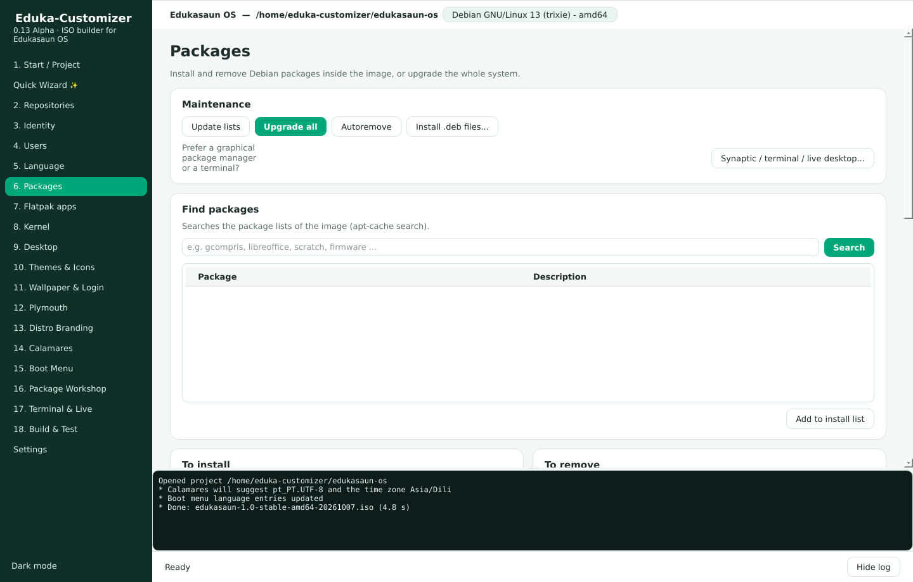 |
| 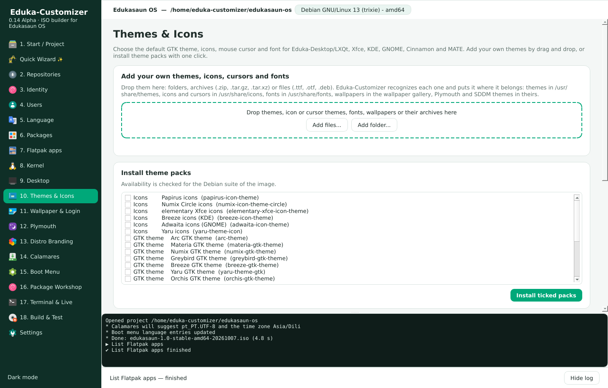 | 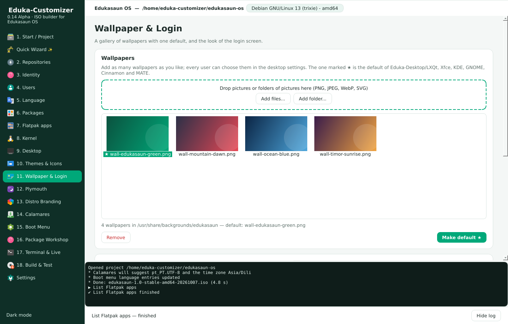 |
| 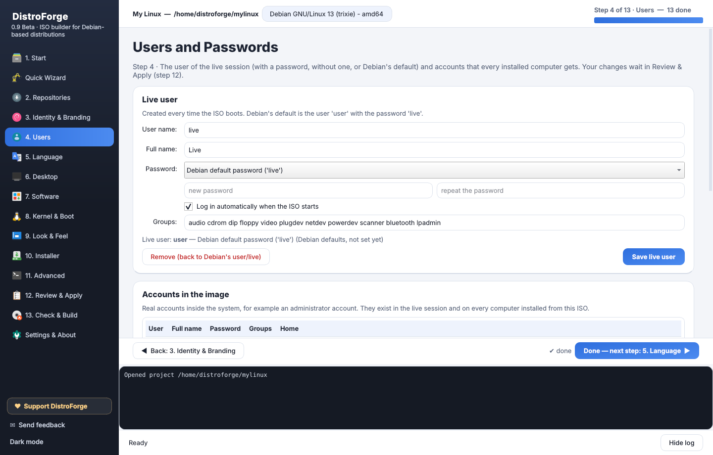 | 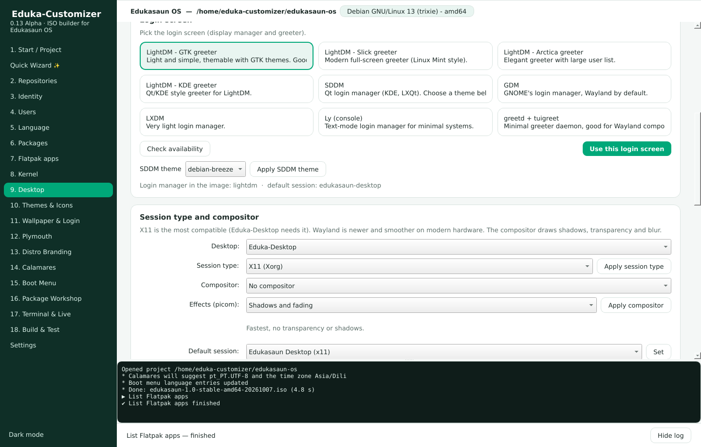 |
| 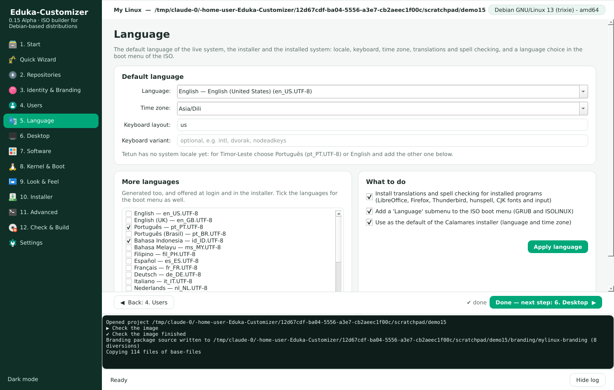 | 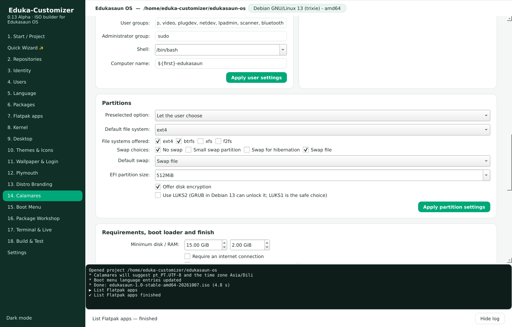 |
| 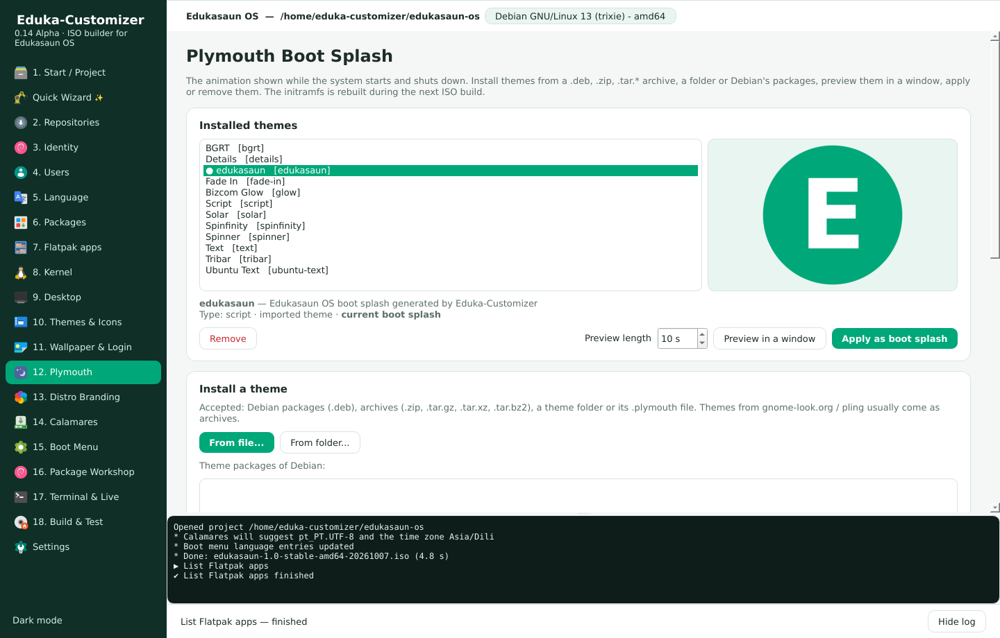 |  |
| 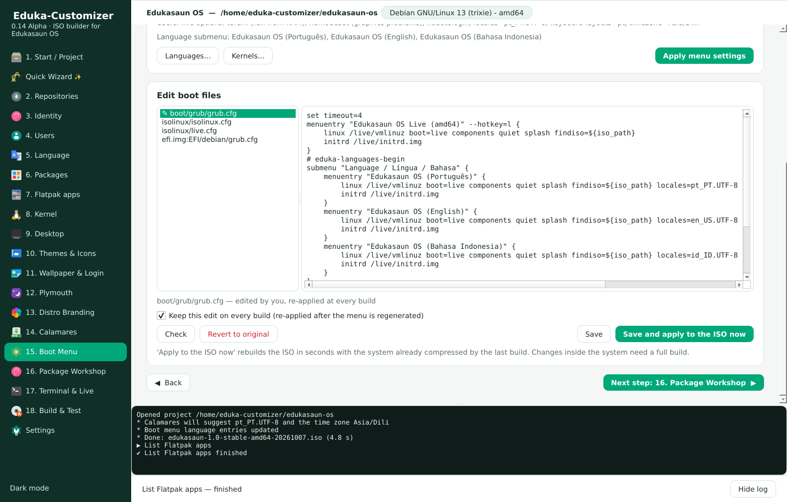 | 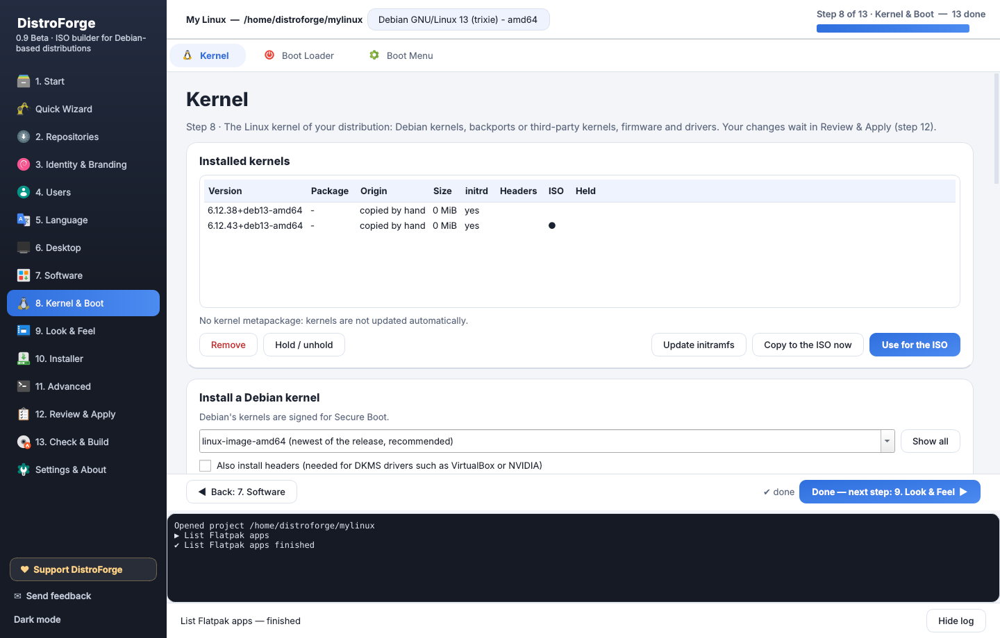 |
|  | 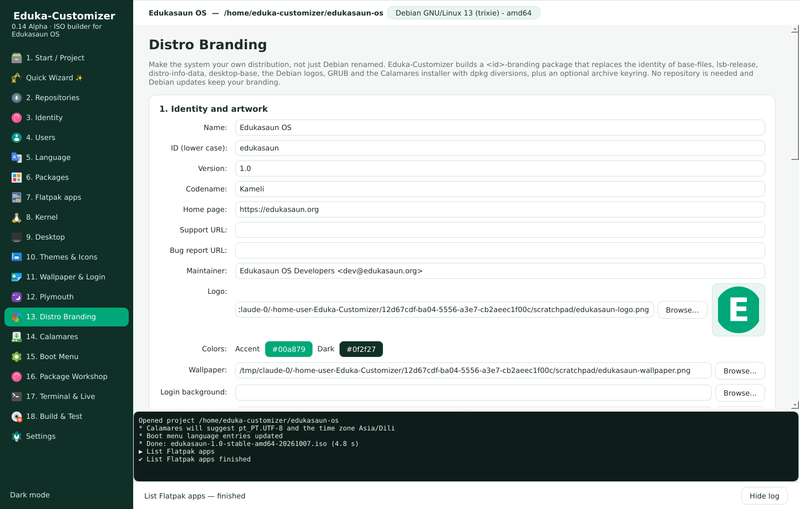 |
|  |  |
|  |  |
| 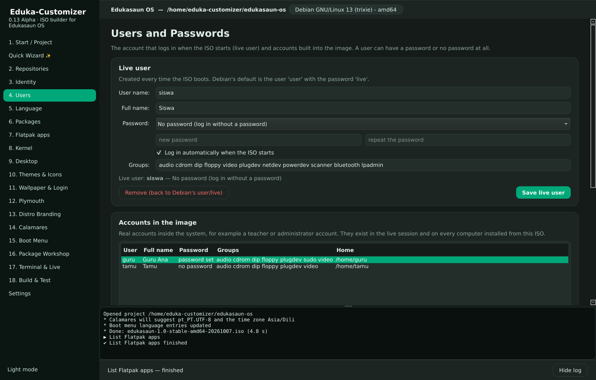 |  |

All screenshots, including every Quick Wizard step: [docs/screenshots](docs/screenshots).

## Install

On Debian 13 (trixie), a Debian derivative, Ubuntu 22.04/24.04 or an Ubuntu-based system:

```sh
sudo apt install ./release/eduka-customizer_0.15.0~alpha_all.deb   # ready-made package
# or build it yourself:
sudo apt install debhelper python3-pytest python3-yaml dpkg-dev
dpkg-buildpackage -us -uc -b
sudo apt install ../eduka-customizer_0.15.0~alpha_all.deb
```

Or run it from the source tree:

```sh
sudo apt install python3-pyqt6 python3-yaml xorriso squashfs-tools mtools dosfstools isolinux \
    syslinux-common grub-efi-amd64-bin mmdebstrap xserver-xephyr qemu-system-x86 ovmf git rsync
sudo make run
```

Check the computer with `eduka-customizer doctor`. The package works with PyQt6 or
PyQt5 and Python 3.9 or newer.

### When something goes wrong

Every run writes logs for the developers:

* `/tmp/eduka-customizer/eduka-customizer.log` — full debug log
* `/tmp/eduka-customizer/errors.log` — errors with tracebacks
* Settings → **Create bug report** packs both with the project state.

## Quick start (GUI)

1. Start **Eduka-Customizer** from the menu (it asks for the administrator password).
   The fastest way: **Quick Wizard** → Next, Next, Finish.
2. **1. Start**: create a project, then choose a Debian live ISO (the *standard* ISO is
   recommended), another Debian-based ISO, *Download Debian*, or *New Debian base*. Answer
   *What is your distribution for?* and pick the ISO edition, or close it to decide everything yourself.
3. Press **Done — next step** at the bottom of every step: 2. Repositories, 3. Identity & Branding,
   4. Users, 5. Language, 6. Desktop, 7. Software, 8. Kernel & Boot, 9. Look & Feel, 10. Installer,
   11. Advanced. The next menu opens when the step before it is done.
4. **12. Check & Build**: check the image, build the ISO and boot it in QEMU.
5. Write the ISO to a USB stick: `sudo dd if=mylinux.iso of=/dev/sdX bs=4M status=progress oflag=sync`.

## Quick start (command line)

```sh
sudo eduka-customizer new ~/mylinux --iso debian-live-13.1.0-amd64-standard.iso
cd ~/mylinux
sudo eduka-customizer sources --suite stable
sudo eduka-customizer brand identity name="My Linux" id=mylinux version=1.0 codename=Aurora
sudo eduka-customizer purpose apply home --edition full_apps          # or: education, server, professional
sudo eduka-customizer desktop install xfce --edition compact --dm lightdm   # mini, compact, full, full_apps
sudo eduka-customizer apps replace browser chromium --remove-old       # replace a default application
sudo eduka-customizer apps status
sudo eduka-customizer apt install libreoffice vlc
sudo eduka-customizer flatpak install org.geogebra.GeoGebra --firstboot
sudo eduka-customizer branding apply --logo logo.png --wallpaper wallpaper.png --keyring --email archive@example.org
sudo eduka-customizer themes apply --gtk Arc --icons Papirus --cursor Breeze_Snow
sudo eduka-customizer assets ~/Downloads/Nordic.tar.xz ~/Downloads/*.ttf    # themes, icons, fonts ...
sudo eduka-customizer users live live --fullname Live --no-password   # live user "live", no password
sudo eduka-customizer language set pt_PT.UTF-8 --extra en_US.UTF-8 --timezone Asia/Dili --boot-menu all
sudo eduka-customizer calamares partition fs=btrfs efi_size=512MiB "swap=[none, file]" initial_swap=file
sudo eduka-customizer kernel third-party backports --headers
sudo eduka-customizer check --deep                                     # what would break the ISO
sudo eduka-customizer build
eduka-customizer test --firmware uefi
```

Eduka-Desktop is still one command away: `sudo eduka-customizer desktop install eduka`.
Or apply a recipe: `sudo eduka-customizer -p ~/mylinux recipe apply examples/my-distro.json`
(`examples/edukasaun-school.json` is an Eduka-Desktop school edition).

## Documentation

* [Manual](docs/manual.md) — every page and command explained.
* [Panduan singkat (Bahasa Indonesia)](docs/PANDUAN.md)
* [Roadmap and recommendations](docs/ROADMAP.md)
* [Changelog](CHANGELOG.md)

## Ringkasan (Bahasa Indonesia)

Eduka-Customizer adalah pembangun ISO untuk **semua distribusi berbasis Debian**
(Debian stable, testing, sid dan turunannya seperti LMDE — bukan berbasis Ubuntu).
Tidak ada lagi pengaturan bawaan Edukasaun OS: nama, ID, host name dan homepage
kosong sampai Anda mengisinya; **Eduka-Desktop** tetap tersedia sebagai salah satu
desktop. Versi 0.15:

* **Langkah demi langkah**: 12 langkah bernomor; langkah berikutnya baru terbuka
  setelah langkah sebelumnya selesai (**Done — next step**). Mode ahli: Settings →
  *Free navigation*.
* **Menu digabung** (tab): Identity & Branding; Software (Packages, Flatpak,
  Replace apps); Kernel & Boot; Look & Feel (Themes & Icons, Wallpaper & Login,
  Plymouth); Advanced (Terminal & Live, Package Workshop).
* **Edisi desktop/WM**: Mini, Compact, Full, Full with apps — daftar DE, WM dan
  compositor hanya yang tersedia di Debian.
* **Edisi ISO**: Minimal, Full, Full with recommended apps.
* **Replace apps**: ganti browser, mail, office, editor, file manager, terminal,
  penampil gambar/PDF, pemutar video/musik, arsip, kalkulator bawaan dengan
  program lain; yang lama bisa dihapus tanpa ikut menghapus desktop.
* **Check & Build**: pemeriksaan sebelum build (database paket, kernel/initrd,
  live-boot, sesi desktop, installer, file boot, data pribadi, ruang disk, ukuran
  ISO); masalah serius menghentikan build.

Paket siap pasang: `release/eduka-customizer_0.15.0~alpha_all.deb`. Panduan
lengkap: [docs/PANDUAN.md](docs/PANDUAN.md). Log error: `/tmp/eduka-customizer/`.

## License

GNU General Public License version 3 or later. See [LICENSE](LICENSE).
Original Customizer contributors are listed in [data/contributors](data/contributors).
