# DistroForge 0.17 Alpha

**DistroForge** (formerly *Eduka-Customizer*) builds live ISO images of **your
own Debian-based distribution**. It takes a Debian live image (or a Debian
derivative such as LMDE, MX Linux or Kali), a fresh Debian base or the running
computer and guides you **step by step** to a new, bootable ISO: repositories,
identity, users, language, desktop, software, kernel and boot menu, look and
feel, sounds, welcome screen, installer, **Review & Apply** and **Check &
Build**. Every name is yours: nothing is preset for a particular distribution.

The images it builds are always **Debian-based**: Debian stable, testing, sid
or a Debian derivative (Ubuntu-based images are refused as a source). The
recommended start is the **Debian live standard ISO**: no desktop, small and
clean. DistroForge itself installs on Debian, Debian derivatives, **Ubuntu and
Ubuntu-based** computers.

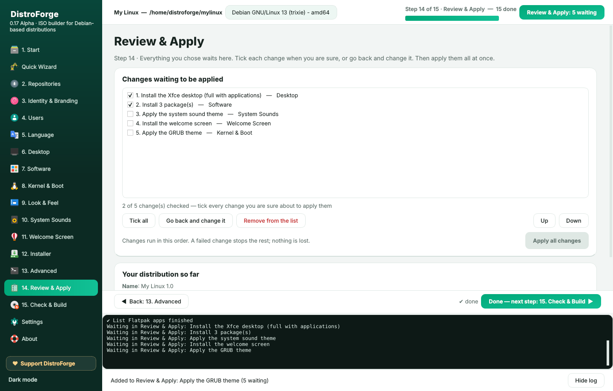

> DistroForge is free and open source software (GPL-3.0-or-later). It is a
> complete rewrite of *Customizer* (Ivailo Monev, Mubiin Kimura, Graham Cantin
> and contributors) and takes ideas from *Cubic*, *remastersys* and
> *penguins-eggs*. It is not affiliated with Debian.

**User guides (PDF):** [Bahasa Indonesia](docs/DistroForge-Panduan.pdf) ·
[English](docs/DistroForge-Guide.pdf)

**Support the project:** [Donate with PayPal](https://paypal.me/hugocenturion0311) ·
[Facebook](https://facebook.com/hugomonizdorego)

## New in 0.17

* **New name: DistroForge.** The package `distroforge` replaces `eduka-customizer`; the old commands
  (`eduka-customizer`, `eduka-customizer-pkexec`) and the settings in `/etc/eduka-customizer` keep
  working.
* **Fix automatically or by hand.** Every problem found by *Check & Build* and *Check the installer*
  says how to fix it. *Fix automatically* installs missing packages, repairs the package database,
  corrects Calamares settings and checks again; problems that need you open the right step on a
  double-click. Building with problems left asks: *Fix automatically*, *I will fix it myself* or
  *Build anyway*.
* **No more false alarm for GRUB**: Debian live ISOs that install GRUB from the ISO pool during
  installation are no longer reported as missing `grub-install`.
* **Review & Apply (step 14).** Changes wait in one list instead of changing the image at once. Tick
  each one when you are sure, go back and change it, remove it or change the order, then apply them
  all together. Experts can switch back to applying at once in Settings.
* **ISO size targets**: as small as possible, 100 MB, 300 MB, 500 MB, 700 MB (CD), 1 GB, 2 GB,
  4.4 GB (DVD) or no limit. *Estimate* compresses a sample of the system and chooses the fastest
  compression that reaches the target. Compression is lossless, so a smaller ISO is never a damaged
  ISO. Safe size savers (documentation, manual pages, unused translations, APT lists, old kernels)
  are suggested when needed; license files always stay.
* **About**: version, license (GPL-3.0-or-later), credits, the license of every component, trademark
  notes, the PDF user guides and donation links.
* **Clearer words** on every page, in the dialogs and in `distroforge --help` (commands listed by
  step); a warning when the distribution name uses a trademark such as Debian or Ubuntu.

## New in 0.16

* **System Sounds** (step 10): sounds for boot, login (startup), log out, shutdown, errors, warnings,
  notifications, devices and power. They become a freedesktop sound theme that is the default of GNOME,
  KDE, Xfce, Cinnamon, MATE, Budgie, LXQt and GTK applications; boot and shutdown sounds are played by a
  systemd service, the login sound by an autostart entry. Drop a folder: `boot.ogg`, `login.wav`,
  `error.oga`... are matched to their event.
* **Welcome Screen** (step 11): four pages you design — titles, text with **bold**, *italic* and links,
  your logo, pictures, colors and buttons that open a website, start a program or the installer. Shown
  after login until the user unticks *Show this at startup* (or only live, only installed, only from the
  menu). A small GTK program, so it works on every desktop.
* **Identity & Branding start from the ISO**: name, ID, version, codename, links, host name, volume
  label, logo, wallpaper, login and GRUB backgrounds and installer colors are read from the extracted ISO;
  change what you like.
* **Editions in each desktop's own words**: *GNOME Core*, *KDE Plasma with KDE Gear*, *Xfce with
  Goodies*, *MATE with extras*, *Cinnamon desktop environment*... with the Debian description of the
  package, read from the image's APT lists.
* **Flatpak for every kind of distribution**: the whole Flathub catalog by category (Productivity &
  Office, Audio & Video, Graphics, Networking, Education, Science, Games, Developer Tools, System,
  Utilities), fetched from flathub.org or Flathub's AppStream data; tick and add.
* **Replace apps applies to everyone**: also Xfce, KDE, LXQt, GNOME, Cinnamon and MATE settings and the
  lists in /etc/skel.
* **Kernel terminal**: type the commands of a kernel's website (repository, key, `apt update`); its
  kernels are listed. Install one and the repository stays; otherwise it is temporary and removed.
* **Look & Feel per desktop**: only icon, GTK, Qt, window and cursor themes that fit the chosen desktop or
  window manager; window themes for Xfwm4, Openbox, Cinnamon, Marco/Metacity, Plasma and Kvantum.
* **Calamares**: text slides people can read while installing; a careful installer check (branding
  component name, images, slideshow, every module of the sequence, unpackfs, boot loader tools, display
  manager, packages, file systems, groups, commands) in the Installer step and in Check & Build; Distro
  Branding keeps the ISO's branding component and EFI id.
* **GRUB Design**: third-party GRUB themes, checked first and refused when GRUB could not show them; a
  menu designer (entries, order, default, timeout, colors); the boot loader of installed systems: GRUB,
  GRUB with Secure Boot, systemd-boot or rEFInd (LILO, BURG, EFISTUB and Syslinux are explained, not
  offered).
* **A more modern window**: gradient sidebar, pill tabs, cards, and *Step N of 15* with a progress bar.

## New in 0.15

* **For every Debian-based distribution.** New projects start empty (name, ID, host name, home page);
  until you name your distribution the image's own `os-release` is used. Old projects keep working:
  their `*-edukasaun*` configuration files are renamed automatically.
* **Step by step.** 12 numbered steps; a step opens when the one before it is done
  (*Done — next step*). Settings → *Free navigation* opens every menu at any time (expert mode); the
  Quick Wizard opens all steps when it finishes.
* **Merged menus.** Related pages share one menu as tabs: *Identity & Branding*, *Software* (Packages,
  Flatpak, Replace apps), *Kernel & Boot*, *Look & Feel* (Themes & Icons, Wallpaper & Login,
  Plymouth), *Advanced* (Terminal & Live, Package Workshop).
* **Desktop editions.** Every desktop and window manager in **Mini**, **Compact**, **Full** or
  **Full with apps**. The list contains only what Debian ships: GNOME, KDE Plasma, Xfce, Cinnamon,
  MATE, LXQt, LXDE, Budgie, GNOME Flashback, Enlightenment, Eduka-Desktop and the window managers
  Openbox, i3, Fluxbox, IceWM, awesome, JWM, herbstluftwm, bspwm, dwm, spectrwm, Sway, labwc, Wayfire
  and Hyprland (trixie and newer). Native compositors: Mutter, KWin, xfwm4, Muffin, Marco, Metacity,
  Budgie's and Enlightenment's.
* **ISO editions.** *What is your distribution for?* now asks for **Minimal**, **Full** or **Full with
  recommended apps**.
* **Replace default applications.** Swap the browser, mail, word processor, spreadsheet, editor, file
  manager, terminal, image viewer, video and music player, PDF viewer, archive manager or calculator:
  the new program becomes the default for its files (`/etc/xdg/mimeapps.list`) and Debian
  alternatives (`x-www-browser`, `x-terminal-emulator`, ...), the old one can be removed. Removing an
  application never takes the desktop with it.
* **Check & Build.** Checks before every build: distribution, build tools, package database
  (half-installed packages, `apt-get check`), kernel and initrd, live-boot, desktop sessions and
  login screen, installer, identity, edited boot files, leftover mounts and `policy-rc.d`, private
  data, free disk space and the expected ISO size. Real problems stop the build.

## Features

| Area | What you can do |
|------|-----------------|
| Purpose | *What is your distribution for?* Education, Server, Professional, Home or Other — recommendations for desktop, login screen, compositor, look and applications that you can untick or close |
| Packages | Every package of the Debian sources with tick boxes and instant search; remove the applications that came with the ISO; or use a terminal / Synaptic |
| Your own look | Drag and drop themes, icons, cursors, fonts, wallpapers, Plymouth and SDDM themes (folders, archives, files): each goes where it belongs. Wallpaper gallery with one default |
| Compositors | The desktop's own compositor (Mutter, Muffin, KWin, xfwm4, Marco, Budgie) or picom where it fits — never two at once |
| Users | The live user with a password, **without a password** or with Debian's default, autologin and groups; accounts built into the image (with or without a password, administrator), change or remove passwords, delete accounts |
| Language | Default language, keyboard, time zone (Asia/Dili by default), translations and spell checking, a *Language* submenu in the ISO boot menu, Calamares defaults; also chosen when a project is created |
| Calamares | Edit the installer directly: name, logo and images, colors, slideshow, launcher, user and password rules, live user password, partitions (file systems, swap, EFI size, encryption), requirements, removed packages, every configuration file |
| Plymouth | Install boot splash themes from .deb, .zip, .tar.*, folders or Debian packages; preview them in a window; apply; remove; create one from a logo |
| Boot Menu | Title, timeout, kernel options, background; edit `grub.cfg`, `isolinux.cfg` and the GRUB files inside `efi.img` directly; edits survive every build; apply to the ISO in seconds |
| Kernel | Debian, backports, Liquorix, XanMod, your own repository or .deb kernels; remove, hold, initramfs, ISO kernel, GRUB defaults of the installed system, firmware, DKMS |
| Quick Wizard | Build a whole distribution with Next, Next, Finish: source, identity, base, desktop, look, apps, branding, build |
| Distro Branding | Your own `<id>-branding` package replacing the identity of base-files, lsb-release, distro-info-data, desktop-base, Debian logos, GRUB (live and installed) and the Calamares installer, plus an optional `<id>-archive-keyring` with your own signing key. Debian source trees are editable |
| Package Workshop | Open any installed package (base-files, desktop-base, ...), edit files and control data directly, rebuild, install, hold, or restore Debian's version |
| Themes & Icons | GTK, icon, cursor and LXQt themes, fonts, dark style, one-click theme packs, theme import, desktop icons |
| Login & session | LightDM (GTK, Slick, Arctica, KDE greeters), SDDM with themes, GDM, LXDM, Ly, greetd; X11 or Wayland; compositor (picom presets, built-in, labwc, KWin, Wayfire, Sway) |
| Developer logs | Every run writes `/tmp/distroforge/distroforge.log` and `errors.log`; Settings → Create bug report |
| Source | Extract a Debian or Debian-based live ISO, download an official Debian live ISO (SHA256 and GPG checked), bootstrap a new Debian base with mmdebstrap, or snapshot the running system (remastersys style) |
| Identity | os-release (`ID=yourdistro`, `ID_LIKE=debian`), version, codename, host name, live user, Calamares branding, protected from `base-files` upgrades |
| Repositories | Switch between stable, testing and sid with a clean deb822 `debian.sources`, add third-party repositories with their own `Signed-By` key, edit every sources file |
| Packages | Search, install, remove, full-upgrade, install local `.deb` files, import/export package lists |
| Flatpak | The whole Flathub catalog by category, search, install into the ISO or on the first boot of the installed system |
| Desktop | GNOME, KDE Plasma, Xfce, Cinnamon, MATE, LXQt, LXDE, Budgie, GNOME Flashback, Enlightenment, Eduka-Desktop (built from git) or 14 window managers, each in a Mini, Compact, Full or Full-with-apps edition; login manager (LightDM, SDDM, GDM, LXDM, Ly, greetd) and default session |
| Replace apps | Another browser, mail program, office, editor, file manager, terminal, viewer or player as the default; remove the old one |
| Review & Apply | Every change waits in one list: tick, go back and change, reorder, then apply all at once |
| Check & Build | Checks before every build stop what would break the ISO; most problems are fixed automatically |
| ISO size | Targets from 100 MB to 4.4 GB or as small as possible, with lossless compression and safe size savers |
| Eduka-Desktop | Fetch any branch/tag, build the `.deb`, install it, and set panel/menu/desktop defaults for every new user |
| Appearance | Plymouth themes (choose, import, or generate one from a logo), wallpaper for all major desktops, login screen background/theme, boot menu title, timeout, kernel options and background |
| Live edit | Run the image's desktop in a nested window (Xephyr) and change settings directly; changes become the defaults in `/etc/skel` |
| Terminal | Root shell inside the image, one-off commands, hook scripts |
| Build | zstd/xz/gzip/lz4/lzo, clean-up of private data (machine-id, SSH keys, logs, history), initramfs update, hybrid BIOS + UEFI ISO, optional Secure Boot (shim), checksums |
| Test | Boot the ISO in QEMU with BIOS, UEFI or UEFI + Secure Boot, with an optional virtual disk to test installation |
| Automation | Full CLI and JSON recipes for reproducible builds and CI |

## Screenshots

| | |
|---|---|
| 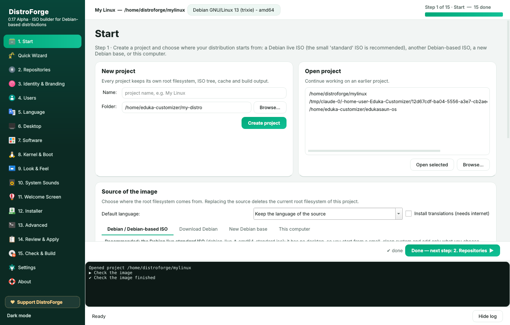 | 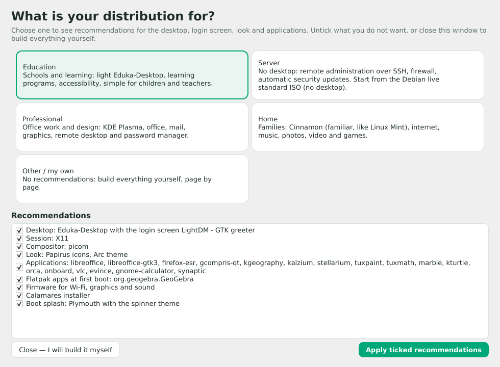 |
| 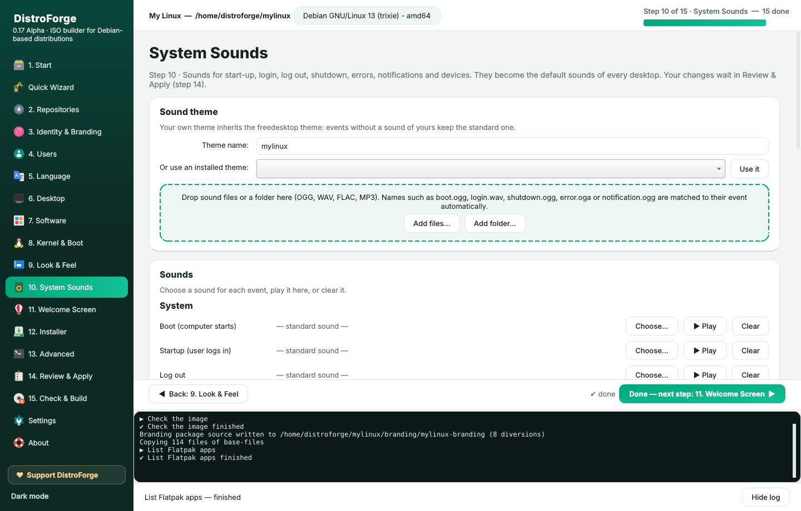 | 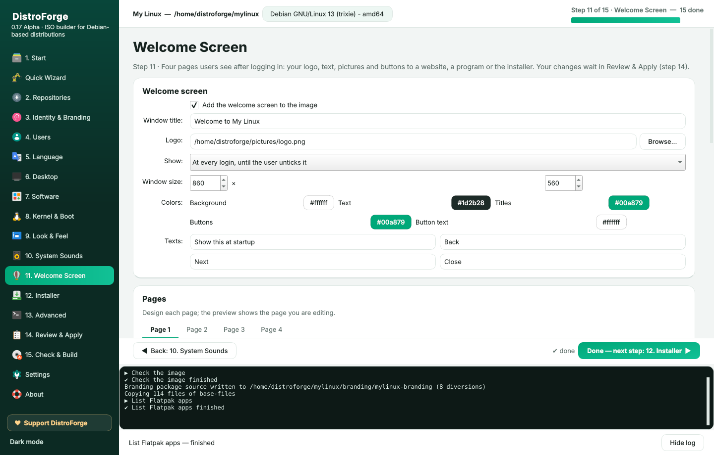 |
| 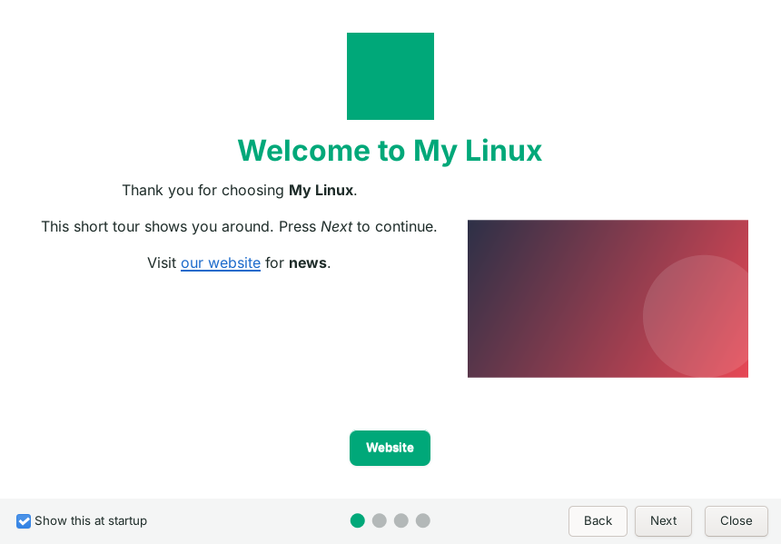 | 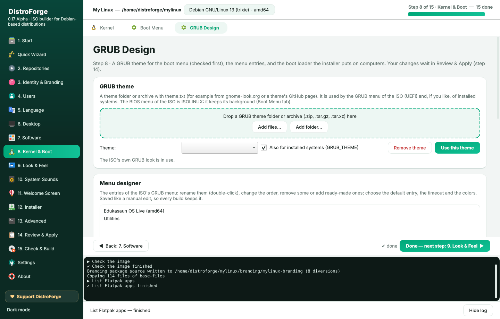 |
| 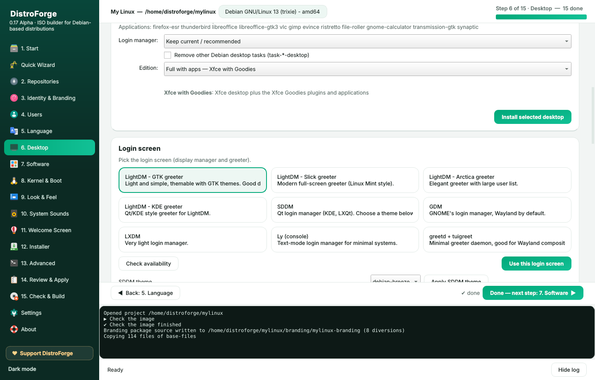 | 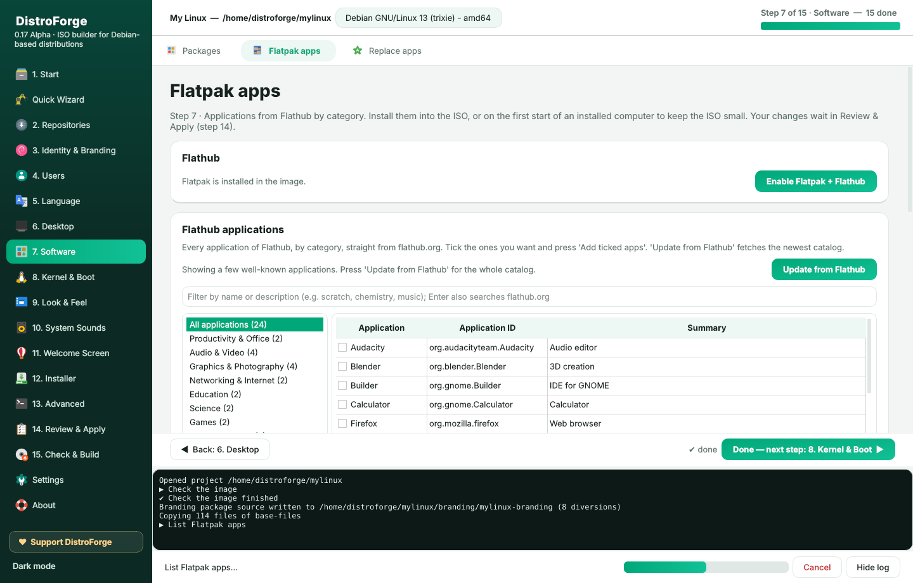 |
| 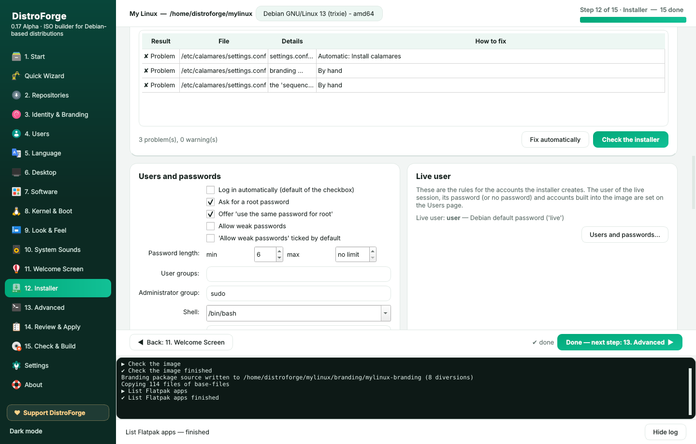 | 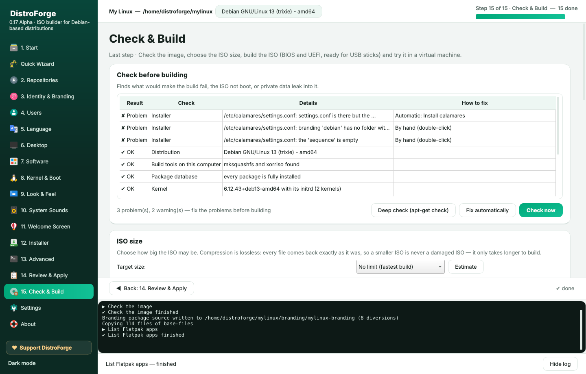 |
|  | 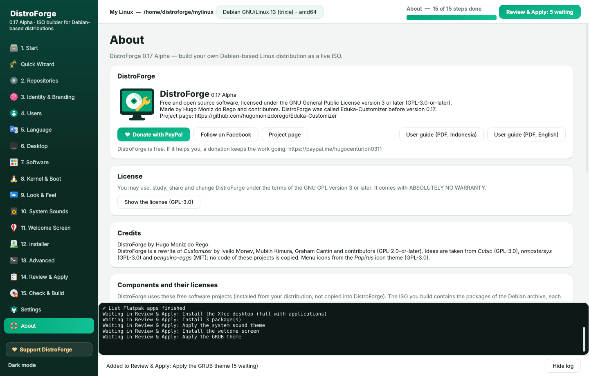 |
| 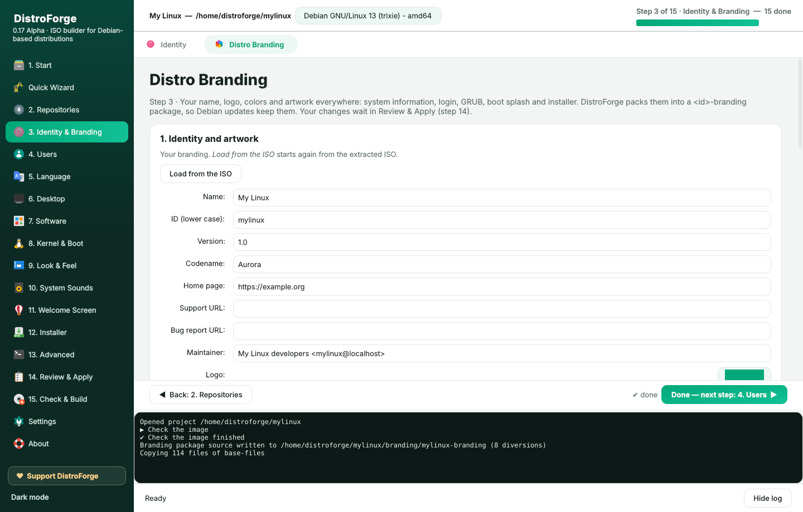 | 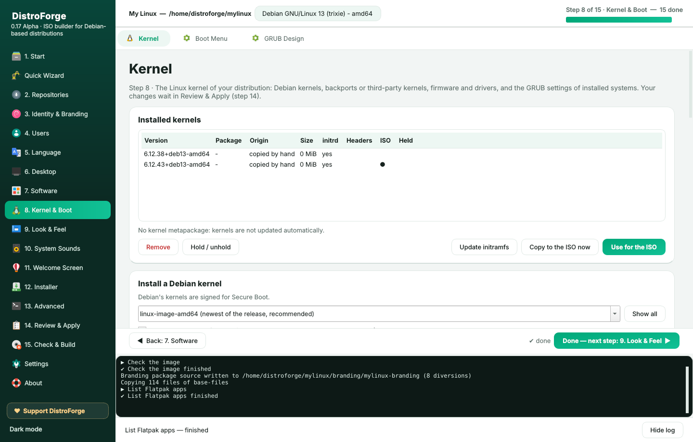 |
| 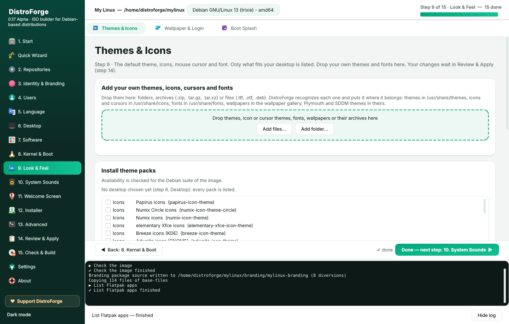 | 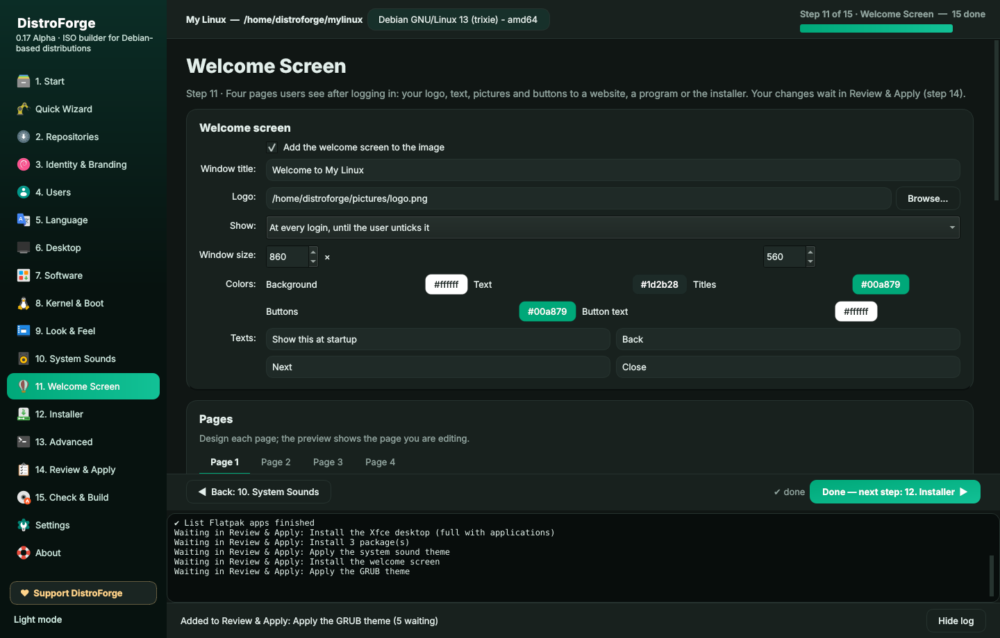 |

All screenshots, including every Quick Wizard step: [docs/screenshots](docs/screenshots).

## Install

On Debian 12/13, a Debian derivative, Ubuntu 22.04/24.04 or an Ubuntu-based system:

```sh
sudo apt install ./release/distroforge_0.17.0~alpha_all.deb   # ready-made package
# or build it yourself:
sudo apt install debhelper python3-pytest python3-yaml dpkg-dev
dpkg-buildpackage -us -uc -b
sudo apt install ../distroforge_0.17.0~alpha_all.deb
```

Or run it from the source tree:

```sh
sudo apt install python3-pyqt6 python3-yaml xorriso squashfs-tools mtools dosfstools isolinux \
    syslinux-common grub-efi-amd64-bin mmdebstrap xserver-xephyr qemu-system-x86 ovmf git rsync
sudo make run
```

Check the computer with `distroforge doctor`. The package works with PyQt6 or
PyQt5 and Python 3.9 or newer.

### When something goes wrong

Every run writes logs for the developers:

* `/tmp/distroforge/distroforge.log` — full debug log
* `/tmp/distroforge/errors.log` — errors with tracebacks
* Settings → **Create bug report** packs both with the project state.

## Quick start (GUI)

1. Start **DistroForge** from the menu (it asks for the administrator password).
   The fastest way: **Quick Wizard** → Next, Next, Finish.
2. **1. Start**: create a project, then choose a Debian live ISO (the *standard* ISO is
   recommended), another Debian-based ISO, *Download Debian*, or *New Debian base*. Answer
   *What is your distribution for?* and pick the ISO edition, or close it to decide everything yourself.
3. Press **Done — next step** at the bottom of every step: 2. Repositories, 3. Identity & Branding,
   4. Users, 5. Language, 6. Desktop, 7. Software, 8. Kernel & Boot, 9. Look & Feel, 10. System Sounds,
   11. Welcome Screen, 12. Installer, 13. Advanced. The next menu opens when the step before it is done.
   Your choices are collected in **Review & Apply**.
4. **14. Review & Apply**: tick every change you are sure about (or go back and change it), then
   *Apply all changes*.
5. **15. Check & Build**: check the image (*Fix automatically* fixes what it can), choose the ISO
   size, build the ISO and boot it in QEMU.
6. Write the ISO to a USB stick: `sudo dd if=mylinux.iso of=/dev/sdX bs=4M status=progress oflag=sync`.

## Quick start (command line)

The command line applies every change at once (there is no review list).

```sh
sudo distroforge new ~/mylinux --iso debian-live-13.1.0-amd64-standard.iso
cd ~/mylinux
sudo distroforge sources --suite stable
sudo distroforge brand identity name="My Linux" id=mylinux version=1.0 codename=Aurora
sudo distroforge purpose apply home --edition full_apps          # or: education, server, professional
sudo distroforge desktop install xfce --edition compact --dm lightdm   # mini, compact, full, full_apps
sudo distroforge apps replace browser chromium --remove-old       # replace a default application
sudo distroforge apt install libreoffice vlc
sudo distroforge flatpak install org.geogebra.GeoGebra --firstboot
sudo distroforge branding apply --logo logo.png --wallpaper wallpaper.png --keyring --email archive@example.org
sudo distroforge themes apply --gtk Arc --icons Papirus --cursor Breeze_Snow
sudo distroforge users live live --fullname Live --no-password   # live user "live", no password
sudo distroforge language set pt_PT.UTF-8 --extra en_US.UTF-8 --timezone Asia/Dili --boot-menu all
sudo distroforge kernel third-party backports --headers
sudo distroforge sounds add ~/sounds/ && sudo distroforge sounds apply   # boot.ogg, login.wav, ...
sudo distroforge grub-theme add ~/Downloads/Vimix-grub.tar.xz --installed   # refused when incompatible
sudo distroforge boot-loader use systemd-boot     # or grub, grub-secureboot, refind
sudo distroforge check --fix                      # check, fix what can be fixed, check again
sudo distroforge build --target-size 700          # smallest, 100, 300, 500, 700, 1000, ..., none
distroforge test --firmware uefi
distroforge about                                 # version, license, credits, donations
```

`distroforge --help` lists the commands in the order of the steps. Eduka-Desktop is still one
command away: `sudo distroforge desktop install eduka`. Or apply a recipe:
`sudo distroforge -p ~/mylinux recipe apply examples/my-distro.json`
(`examples/school-edition.json` is a school edition with Eduka-Desktop).

## Documentation

* User guide (PDF): [Bahasa Indonesia](docs/DistroForge-Panduan.pdf), [English](docs/DistroForge-Guide.pdf)
  (made with `tools/make_guide.py`).
* [Manual](docs/manual.md) — every page and command explained.
* [Panduan singkat (Bahasa Indonesia)](docs/PANDUAN.md)
* [Roadmap and recommendations](docs/ROADMAP.md)
* [Changelog](CHANGELOG.md)

## Ringkasan (Bahasa Indonesia)

**DistroForge** (sebelumnya Eduka-Customizer) adalah pembangun ISO untuk **semua distribusi
berbasis Debian** (Debian stable, testing, sid dan turunannya seperti LMDE, MX Linux, Kali —
bukan berbasis Ubuntu). **Eduka-Desktop** tetap tersedia sebagai salah satu desktop. Versi 0.17:

* **Perbaiki otomatis atau manual** — setiap masalah di *Check & Build* menunjukkan cara
  memperbaikinya; peringatan palsu `grub-install` untuk ISO live Debian sudah hilang.
* **Review & Apply (langkah 14)** — semua perubahan menunggu di satu daftar, dicentang satu per
  satu (atau kembali dan diubah), lalu diterapkan bersama.
* **Target ukuran ISO** — sekecil mungkin, 100 MB, 300 MB, 500 MB, ... 4,4 GB; kompresi lossless,
  ISO tidak rusak.
* **About** — lisensi semua komponen, merek dagang, kredit, panduan PDF dan tombol donasi.
* Semua tulisan dirapikan; nama baru DistroForge (perintah lama tetap bekerja).

Paket siap pasang: `release/distroforge_0.17.0~alpha_all.deb`. Panduan PDF:
[docs/DistroForge-Panduan.pdf](docs/DistroForge-Panduan.pdf). Log error: `/tmp/distroforge/`.

## Support

DistroForge is free. If it helps you, a donation keeps the work going:
[paypal.me/hugocenturion0311](https://paypal.me/hugocenturion0311). News on
[Facebook](https://facebook.com/hugomonizdorego).

## License

DistroForge is free software: GNU General Public License version 3 or later, without any
warranty. See [LICENSE](LICENSE). The licenses of the components it uses are listed on the
About page and in [debian/copyright](debian/copyright); menu icons come from the Papirus icon
theme (GPL-3.0). Original Customizer contributors are listed in [data/contributors](data/contributors).

Debian is a registered trademark of Software in the Public Interest, Inc. Linux® is the
registered trademark of Linus Torvalds in the U.S. and other countries. Other names belong to
their owners. DistroForge is not affiliated with, sponsored or endorsed by Debian or any of
these projects.
