# Eduka-Customizer 0.13 Alpha

**Eduka-Customizer** is the ISO builder for **Edukasaun OS**. It takes a Debian
live image (or an existing Edukasaun OS image, a fresh Debian base, or the
running computer) and turns it into a new, bootable Edukasaun OS ISO image.
You can change anything on the way: packages, Flatpak apps, desktop,
Plymouth splash, login screen, APT sources and the boot menu. You can also run
the system's desktop in a window and edit it live.

The images it builds are always **Debian stable, testing or sid** or **Edukasaun OS**
(Ubuntu-based images are refused as a source). Eduka-Customizer itself can be
installed on Debian, Edukasaun OS, **Ubuntu and Ubuntu-based** computers.

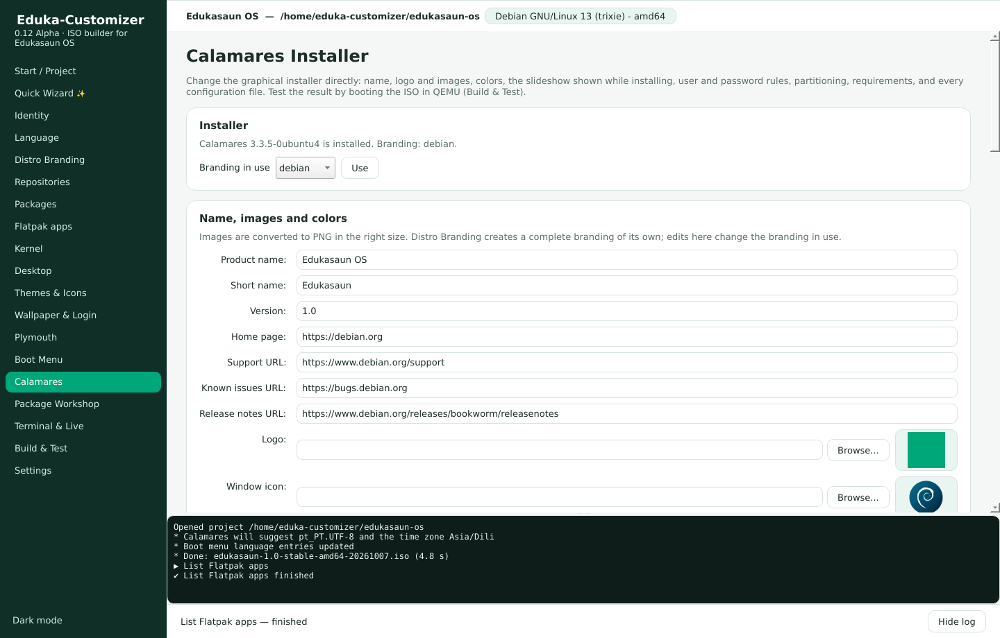

> Eduka-Customizer is a complete rewrite of *Customizer* (Ivailo Monev,
> Mubiin Kimura, Graham Cantin and contributors). It takes ideas from
> *Cubic*, *remastersys* and *penguins-eggs*.

## Features

| Area | What you can do |
|------|-----------------|
| Users | The live user with a password, **without a password** or with Debian's default, autologin and groups; accounts built into the image (with or without a password, administrator), change or remove passwords, delete accounts |
| Language | Default language, keyboard, time zone (Asia/Dili by default), translations and spell checking, a *Language* submenu in the ISO boot menu, Calamares defaults; also chosen when a project is created |
| Calamares | Edit the installer directly: name, logo and images, colors, slideshow, launcher, user and password rules, live user password, partitions (file systems, swap, EFI size, encryption), requirements, removed packages, every configuration file |
| Plymouth | Install boot splash themes from .deb, .zip, .tar.*, folders or Debian packages; preview them in a window; apply; remove; create one from a logo |
| Boot Menu | Title, timeout, kernel options, background; edit `grub.cfg`, `isolinux.cfg` and the GRUB files inside `efi.img` directly; edits survive every build; apply to the ISO in seconds |
| Kernel | Debian, backports, Liquorix, XanMod, your own repository or .deb kernels; remove, hold, initramfs, ISO kernel, GRUB defaults of the installed system, firmware, DKMS |
| Quick Wizard | Build a whole distribution with Next, Next, Finish: source, identity, base, desktop, look, apps, branding, build |
| Distro Branding | Your own `<id>-branding` package replacing the identity of base-files, lsb-release, distro-info-data, desktop-base, Debian logos, GRUB (live and installed) and the Calamares installer, plus an optional `<id>-archive-keyring` with your own signing key. Debian source trees are editable |
| Package Workshop | Open any installed package (base-files, desktop-base, ...), edit files and control data directly, rebuild, install, hold, or restore Debian's version |
| Themes & Icons | GTK, icon, cursor and LXQt themes, fonts, dark style, one-click theme packs, theme import, desktop icons |
| Login & session | LightDM (GTK, Slick, Arctica, KDE greeters), SDDM with themes, GDM, LXDM, Ly, greetd; X11 or Wayland; compositor (picom presets, built-in, labwc, KWin, Wayfire, Sway) |
| Developer logs | Every run writes `/tmp/eduka-customizer/eduka-customizer.log` and `errors.log`; Settings → Create bug report |
| Source | Extract a Debian or Edukasaun OS live ISO, download an official Debian live ISO (SHA256 and GPG checked), bootstrap a new Debian base with mmdebstrap, or snapshot the running system (remastersys style) |
| Identity | os-release (`ID=edukasaun`, `ID_LIKE=debian`), version, codename, host name, live user, Calamares branding, protected from `base-files` upgrades |
| Repositories | Switch between stable, testing and sid with a clean deb822 `debian.sources`, add third-party repositories with their own `Signed-By` key, edit every sources file |
| Packages | Search, install, remove, full-upgrade, install local `.deb` files, import/export package lists |
| Flatpak | Enable Flathub, search Flathub, curated apps for schools, install into the ISO or on the first boot of the installed system |
| Desktop | Eduka-Desktop (built from git), LXQt, Xfce, KDE Plasma, GNOME, MATE, Cinnamon, LXDE, Budgie, or window managers (Openbox, i3, Fluxbox, IceWM, awesome, Sway, labwc); login manager (LightDM, SDDM, GDM, LXDM) and default session |
| Eduka-Desktop | Fetch any branch/tag, build the `.deb`, install it, and set panel/menu/desktop defaults for every new user |
| Appearance | Plymouth themes (choose, import, or generate one from a logo), wallpaper for all major desktops, login screen background/theme, boot menu title, timeout, kernel options and background |
| Live edit | Run the image's desktop in a nested window (Xephyr) and change settings directly; changes become the defaults in `/etc/skel` |
| Terminal | Root shell inside the image, one-off commands, hook scripts |
| Build | zstd/xz/gzip/lz4/lzo, clean-up of private data (machine-id, SSH keys, logs, history), initramfs update, hybrid BIOS + UEFI ISO, optional Secure Boot (shim), checksums |
| Test | Boot the ISO in QEMU with BIOS, UEFI or UEFI + Secure Boot, with an optional virtual disk to test installation |
| Automation | Full CLI and JSON recipes for reproducible builds and CI |

## Screenshots

| | |
|---|---|
| 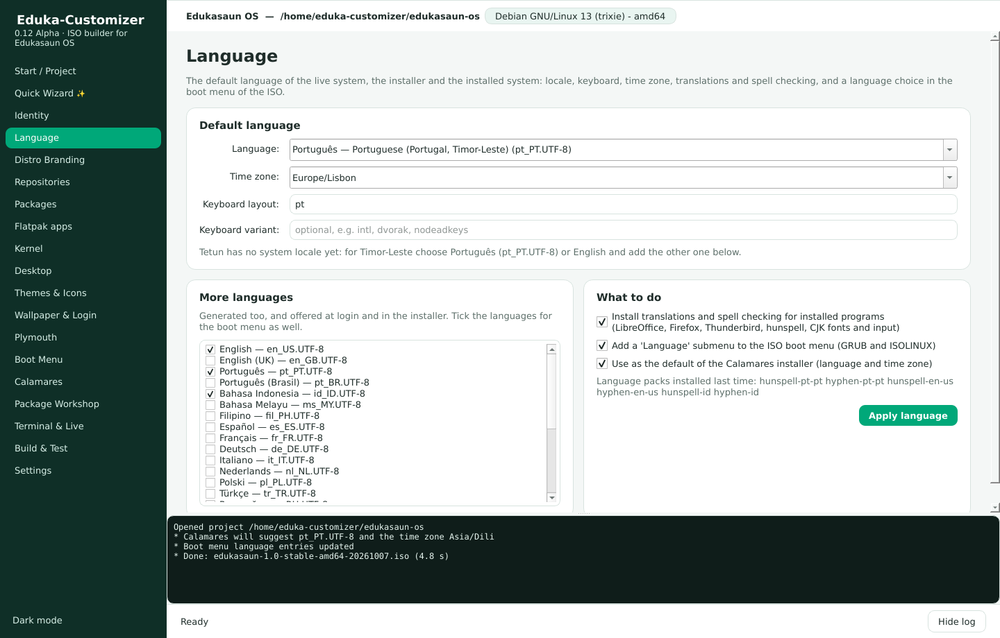 | 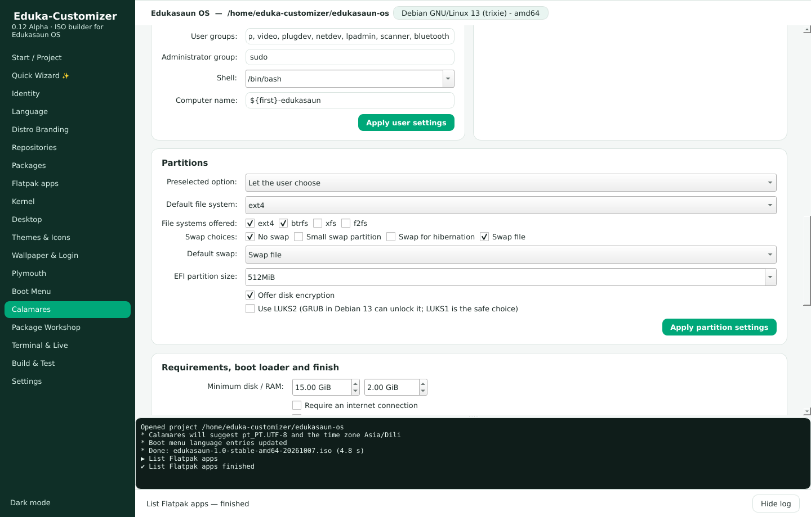 |
| 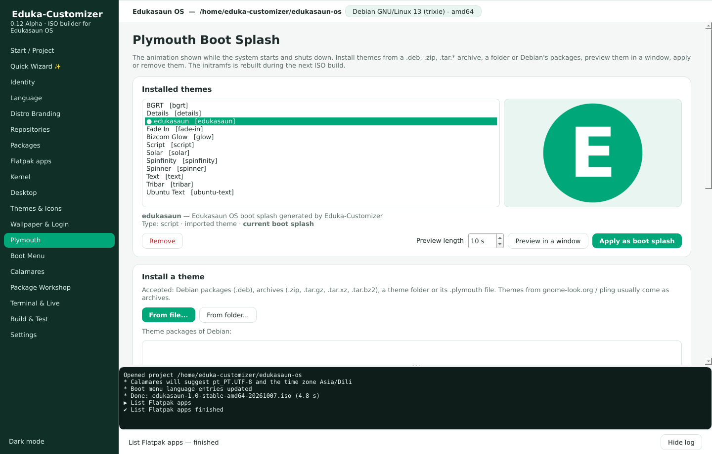 | 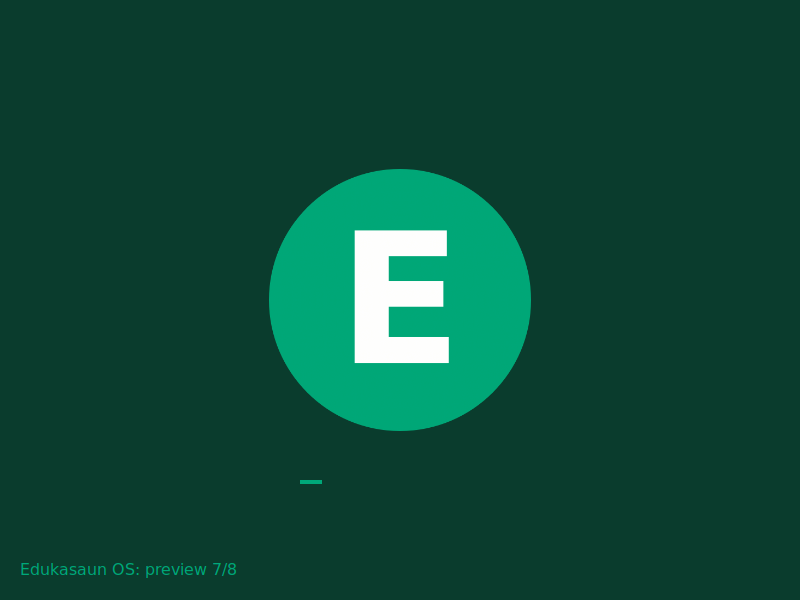 |
| 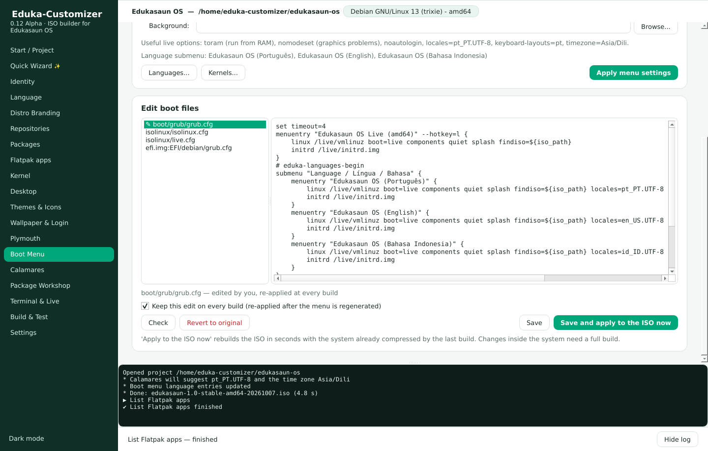 | 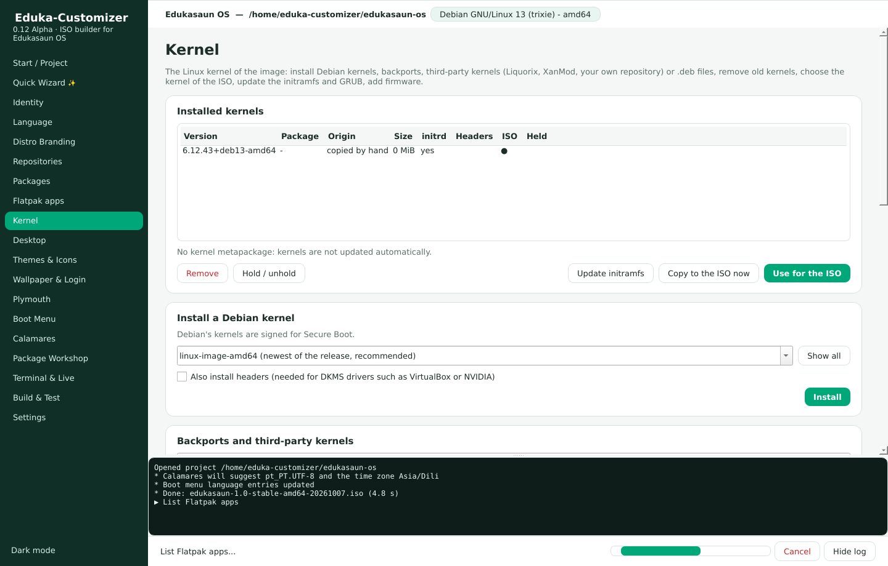 |
| 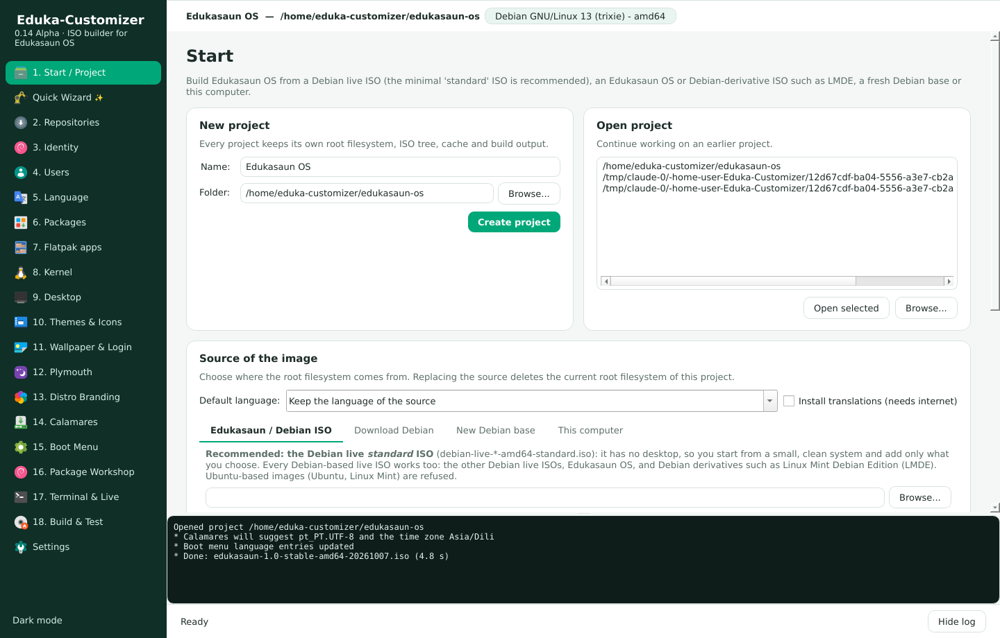 | 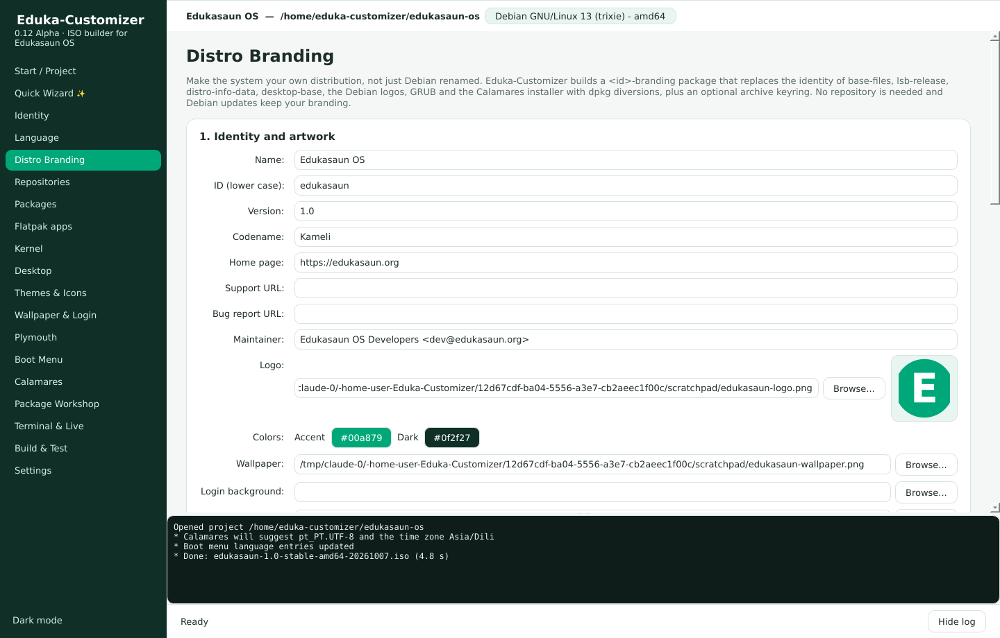 |
| 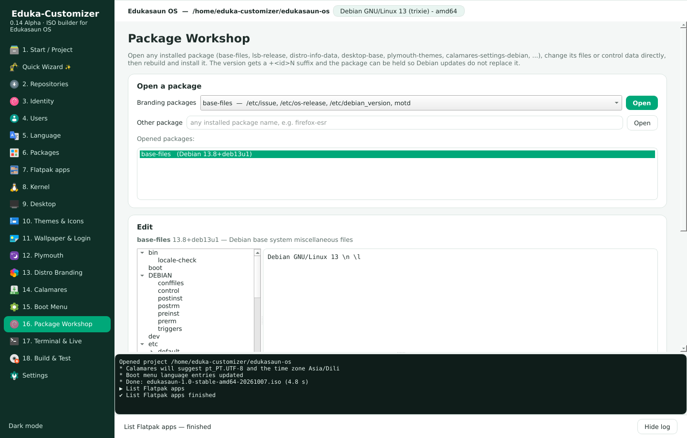 | 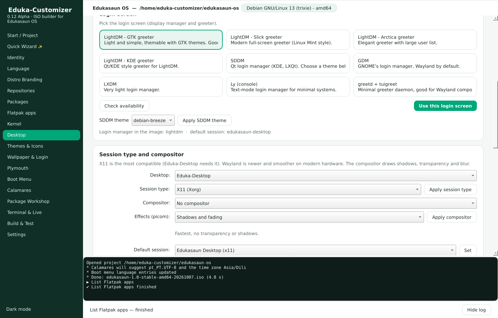 |
| 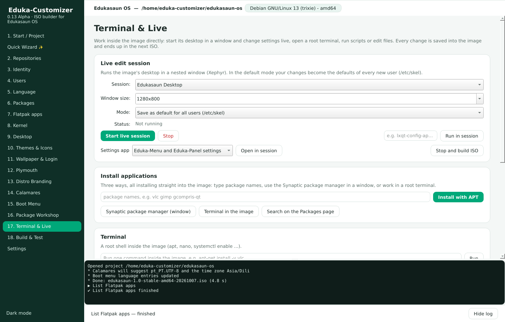 | 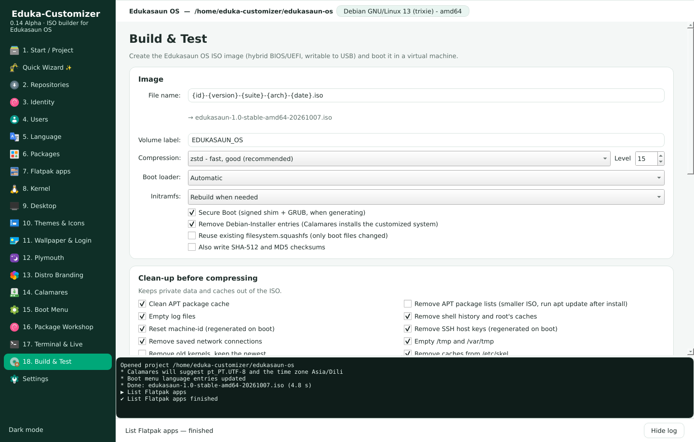 |
| 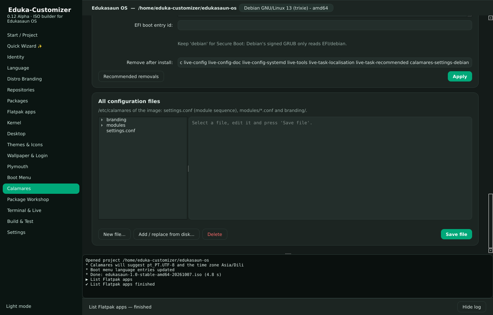 | 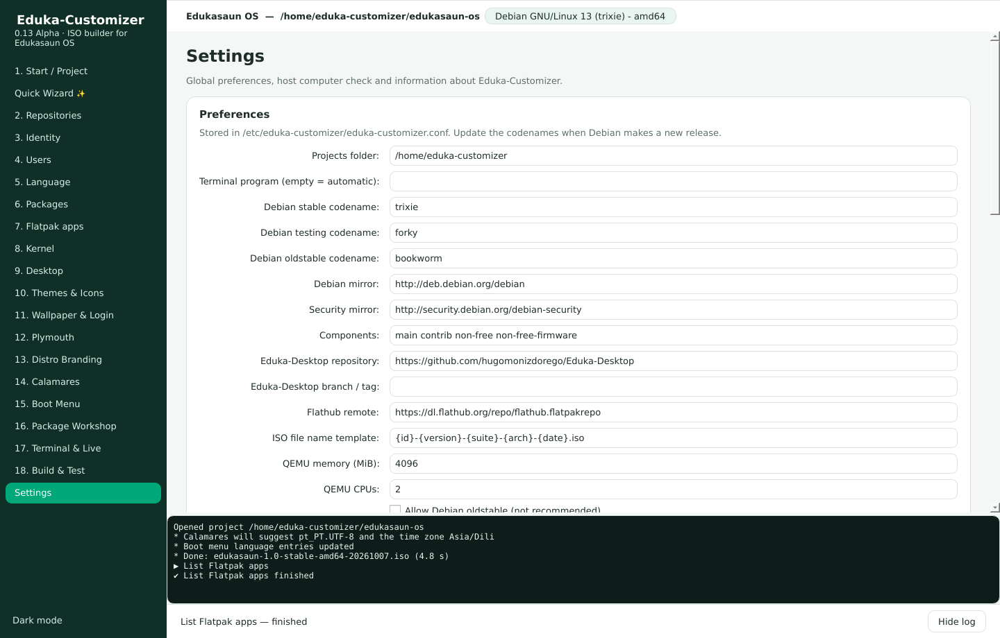 |

All screenshots, including every Quick Wizard step: [docs/screenshots](docs/screenshots).

## Install

On Debian 13 (trixie), Edukasaun OS, Ubuntu 22.04/24.04 or an Ubuntu-based system:

```sh
sudo apt install ./release/eduka-customizer_0.13.0~alpha_all.deb   # ready-made package
# or build it yourself:
sudo apt install debhelper python3-pytest python3-yaml dpkg-dev
dpkg-buildpackage -us -uc -b
sudo apt install ../eduka-customizer_0.13.0~alpha_all.deb
```

Or run it from the source tree:

```sh
sudo apt install python3-pyqt6 python3-yaml xorriso squashfs-tools mtools dosfstools isolinux \
    syslinux-common grub-efi-amd64-bin mmdebstrap xserver-xephyr qemu-system-x86 ovmf git rsync
sudo make run
```

Check the computer with `eduka-customizer doctor`. The package works with PyQt6 or
PyQt5 and Python 3.9 or newer.

### When something goes wrong

Every run writes logs for the developers:

* `/tmp/eduka-customizer/eduka-customizer.log` — full debug log
* `/tmp/eduka-customizer/errors.log` — errors with tracebacks
* Settings → **Create bug report** packs both with the project state.

## Quick start (GUI)

1. Start **Eduka-Customizer** from the menu (it asks for the administrator password).
   The fastest way: **Quick Wizard** → Next, Next, Finish.
2. **Start / Project**: create a project, then choose a Debian live ISO, an
   Edukasaun OS ISO, *Download Debian*, or *New Debian base*.
   Choose the default language right there.
3. Follow the numbered menu with **Next step**: 2. Repositories, 3. Identity,
   4. Users, 5. Language, 6. Packages, 7. Flatpak apps, 8. Kernel, 9. Desktop,
   10. Themes & Icons, 11. Wallpaper & Login, 12. Plymouth, 13. Distro Branding,
   14. Calamares, 15. Boot Menu, 16. Package Workshop, 17. Terminal & Live.
4. **18. Build & Test**: build the ISO and boot it in QEMU.
5. Write the ISO to a USB stick: `sudo dd if=edukasaun.iso of=/dev/sdX bs=4M status=progress oflag=sync`.

## Quick start (command line)

```sh
sudo eduka-customizer new ~/eduka --iso debian-live-13.1.0-amd64-lxqt.iso
cd ~/eduka
sudo eduka-customizer sources --suite stable
sudo eduka-customizer desktop install eduka --dm lightdm
sudo eduka-customizer apt install libreoffice vlc gcompris-qt
sudo eduka-customizer flatpak install org.geogebra.GeoGebra --firstboot
sudo eduka-customizer brand identity name="Edukasaun OS" version=1.0 codename=Kameli
sudo eduka-customizer branding apply --logo logo.png --wallpaper wallpaper.png --keyring --email archive@edukasaun.org
sudo eduka-customizer themes apply --gtk Arc --icons Papirus --cursor Breeze_Snow
sudo eduka-customizer desktop compositor picom --preset glass
sudo eduka-customizer workshop open base-files   # edit files in ~/eduka/workshop/base-files
sudo eduka-customizer workshop build base-files
sudo eduka-customizer users live siswa --fullname "Siswa" --no-password   # live user without password
sudo eduka-customizer users add guru --fullname "Guru" --admin              # asks for the password
sudo eduka-customizer language set pt_PT.UTF-8 --extra en_US.UTF-8 id_ID.UTF-8 --timezone Asia/Dili --boot-menu all
sudo eduka-customizer calamares users min_length=8 autologin=false root_password=true
sudo eduka-customizer calamares partition fs=btrfs efi_size=512MiB "swap=[none, file]" initial_swap=file
sudo eduka-customizer calamares slides slide1.png slide2.png
sudo eduka-customizer plymouth install mytheme.tar.gz --apply
sudo eduka-customizer kernel third-party backports --headers
sudo eduka-customizer bootmenu edit boot/grub/grub.cfg --from my-grub.cfg && sudo eduka-customizer bootmenu apply
sudo eduka-customizer build
eduka-customizer test --firmware uefi
```

Or apply a recipe: `sudo eduka-customizer -p ~/eduka recipe apply examples/edukasaun-school.json`.

## Documentation

* [Manual](docs/manual.md) — every page and command explained.
* [Panduan singkat (Bahasa Indonesia)](docs/PANDUAN.md)
* [Roadmap and recommendations](docs/ROADMAP.md)
* [Changelog](CHANGELOG.md)

## Ringkasan (Bahasa Indonesia)

Eduka-Customizer adalah pembangun ISO khusus **Edukasaun OS** berbasis
**Debian stable, testing dan sid**. Ambil ISO sumber (Debian live atau
Edukasaun OS), bangun desktop (Eduka-Desktop, LXQt, Xfce, KDE, GNOME, WM),
pasang aplikasi lewat APT atau Flatpak/Flathub, edit `sources.list`, ganti
Plymouth, layar login (LightDM GTK, Slick, SDDM, ...), pilih X11/Wayland dan
compositor, tema & ikon, lalu edit sistem secara langsung (live) di jendela
dan simpan ke ISO. **Distro Branding** membuat paket branding sendiri
(pengganti identitas base-files, lsb-release, distro-info-data, desktop-base,
logo Debian, GRUB, Calamares, keyring) dan **Package Workshop** membuka paket
Debian terpasang untuk diedit langsung. Versi 0.13 menambah menu **Users**
(user live dengan password, tanpa password atau default Debian; akun di
dalam image; ubah/hapus password; hapus user), zona waktu default
**Asia/Dili**, dan menu bernomor sesuai urutan kerja sampai Build ISO.
Versi 0.12 menambah menu **Language**
(bahasa default, juga saat membuat/menyesuaikan ISO, pilihan bahasa di menu
boot), **Calamares** (gambar, slideshow, password, partisi, dll.),
**Plymouth** (pasang dari .deb/.zip/.tar, pratinjau, terapkan, hapus),
**Boot Menu** (edit grub.cfg, isolinux dan GRUB EFI langsung lalu terapkan
ke ISO dalam hitungan detik) dan **Kernel** (kernel Debian, backports,
Liquorix, XanMod, repositori sendiri atau .deb, hapus kernel, GRUB, firmware).
Paket siap pasang: `release/eduka-customizer_0.13.0~alpha_all.deb`. Cara tercepat: **Quick Wizard**
(Next, Next, Finish). ISO hasil build bisa langsung diuji di QEMU (BIOS/UEFI).
Aplikasi ini bisa dipasang di Debian, Edukasaun OS, Ubuntu dan turunannya;
ISO sumber harus Debian atau Edukasaun OS. Log error: `/tmp/eduka-customizer/`.

## License

GNU General Public License version 3 or later. See [LICENSE](LICENSE).
Original Customizer contributors are listed in [data/contributors](data/contributors).
